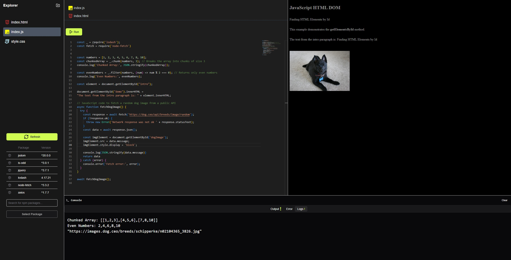

# Package Management and Code Execution API

This API provides functionality for managing Node.js packages and executing code in a sandboxed environment using Docker. It's saves files and installed npm repositories on file system and is able to access them if needed, because of docker all code running environment is secured and independent because for each user it creates new container for user, to run app you have to have .js file, where you can runn app by `Run` button

## Functionality

1. **User Authentication and Management**

   - **JWT Authentication**: Secure endpoints using JSON Web Tokens for user authentication.
   - **Email Validation**: User have to validate there email addresses during registration otherwise they can't be authenticated or authorized.
   - **Password Reset/Recovery**: Allow users to reset or recover their passwords via email.

2. **Package Management**

   - Create and update `package.json` files for users
   - Install dependencies using npm
   - Retrieve a list of installed packages

3. **Code Execution**

   - Run JavaScript code in a sandboxed Docker environment
   - Support for both Node.js runtime and jsdom for browser-like environments

   - It determines if code needs jsdom support or not and chooses endpoint to run JavaScript code based on .js file it receives

4. **Code Preview**
   - Because it has jsdom support it can display html dom and can be styled with css
   - Displays logs, errors and messages from dom

## How It Works

### Docker Integration

The API uses Docker to create a sandboxed environment for package installation and code execution. This ensures security and isolation between different user sessions, because it creates different container for each user, container is defined as `container-name-UserID`

- A custom Docker image `nodejs-sandbox` is Node js server which has two endpoints, one is to run only Node js code and other to run js-dom code.
- It first checks if user has running container and if there is container for that user it re uses existing one to cut down run time delay
- The `./helpers/DockerRunners.js` include function which executes commands within Docker container.
- User directories are mounted as volumes in the Docker container to persist data.

### Custom Node.js Server

The API is built on a custom Node.js server using Express.js.

### Node.js vs jsdom Execution

The system determines whether to use Node.js runtime or jsdom based on the requirements of the code being executed:

- If the code requires browser-like APIs, jsdom is used to simulate a browser environment.
- For server-side or general JavaScript execution, the Node.js runtime is used.

This decision is typically made based on the presence of browser-specific APIs in the user's code or explicit configuration. one will not work as anothat, its same for both cases because when server recives user's code it is wrapper in some additional logic and it is stored in new .js file, for more info about this, can see:
`./routes/runCodeRoute.js, From line 66`

## Tech Stack

- **Backend**: Node.js with Express.js
- **Package Management**: npm
- **Containerization**: Docker
- **Browser Simulation**: jsdom
- **HTTP Client**: Axios (for npm registry queries)
- **Database**: mysql
- **Authentication**: JWT

## API Endpoints

1. **POST /create-package**

   - Creates or updates a `package.json` file for a user
   - Adds specified packages to the dependencies

2. **POST /install**

   - Installs packages listed in the user's `package.json`
   - Executes `npm install` in a Docker container

3. **POST /packagelist**

   - Retrieves the list of installed packages for a user, from user directory in `package.json`

   4. **POST /auth/register**

   - Registers a new user with email validation

4. **POST /auth/login**

   - Authenticates a user and returns a JWT token

5. **POST /auth/verify-email**

   - Email verification

6. **POST /auth/token**
   - Manage auth token
7. **POST /auth/reset-email-verify**
   - Reset password by url which is send to user's email

## Setup and Running

1. Ensure Docker is installed and running on your system.
2. Build the `nodejs-sandbox` Docker image (Dockerfile should be provided separately).
3. Install Node.js dependencies for the API server:
   `npm install`
